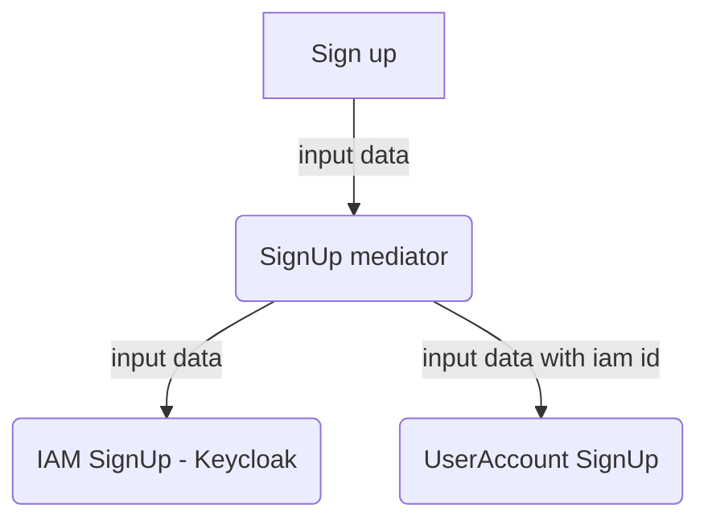
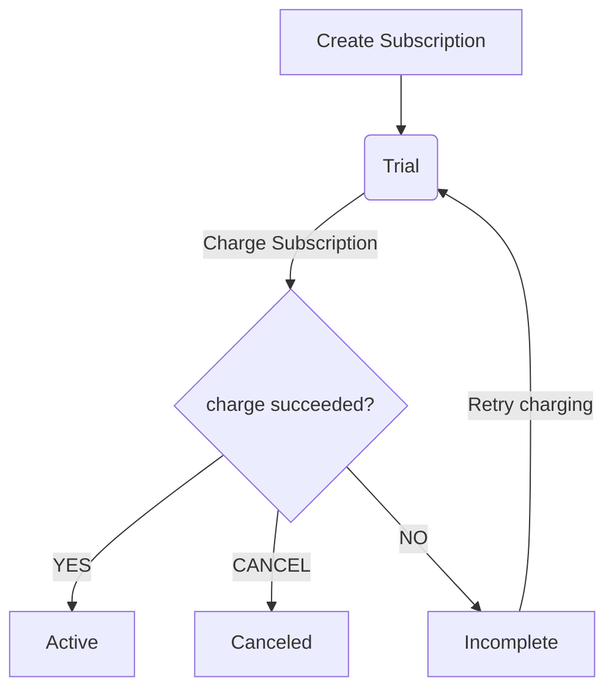

<center>
  <p align="center">
    &nbsp;
    
  </p>  
  <h1 align="center">🚀 Microserviço: Assinatura com Java</h1>
  <p align="center">
    Microserviço referente ao backend das assinaturas do Codeflix<br />
    Utilizando Clean Architecture, DDD, TDD e as boas práticas atuais de mercado
  </p>
</center>
<br />

## Ferramentas necessárias

- JDK 21
- IDE de sua preferência
- Docker

## Workflows

### Detalhes da criação de um usuário com vínculo no Keycloak


### Ciclo de vida de uma Subscription



## Kafka Connect

### Debezium

Creating the debezium mysql user:
```sql
CREATE USER IF NOT EXISTS 'debezium'@'%' IDENTIFIED WITH mysql_native_password BY 'debezium';
GRANT SELECT, RELOAD, SHOW DATABASES, REPLICATION SLAVE, REPLICATION CLIENT ON *.* TO 'debezium'@'%';
FLUSH PRIVILEGES;
```

Creating the kafka connect connector for the Debezium:
```shell
curl --location --request PUT 'http://localhost:8083/connectors/subscription-mysql-cdc/config' \
--header 'Content-Type: application/json' \
--data '{
    "connector.class": "io.debezium.connector.mysql.MySqlConnector",
    "database.hostname": "mysql",
    "database.port": "3306",
    "database.user": "debezium",
    "database.password": "debezium",
    "database.server.id": "10001",
    "database.include.list": "subscription",
    "table.include.list": "subscription.events",
    "database.history.kafka.bootstrap.servers": "kafka:9092",
    "database.history.kafka.topic": "subscription.dbhistory",
    "skipped.operations": "t,r,u,d",
    "include.schema.changes": "false",
    "topic.prefix": "subscription",
    "schema.history.internal.kafka.bootstrap.servers": "kafka:9092",
    "schema.history.internal.kafka.topic": "schemahistory.subscription"
}'
```

## Banco de dados

O banco de dados principal é um MySQL e para subir localmente vamos utilizar o
Docker. Execute o comando a seguir para subir o MySQL:

```shell
docker-compose up -d
```

Pronto! Aguarde que em instantes o MySQL irá estar pronto para ser consumido
na porta 3306.

### Migrações do banco de dados com Flyway

#### Executar as migrações

Caso seja a primeira vez que esteja subindo o banco de dados, é necessário
executar as migrações SQL com a ferramenta `flyway`.
Execute o comando a seguir para executar as migrações:

```shell
./gradlew flywayMigrate
```

Pronto! Agora sim o banco de dados MySQL está pronto para ser utilizado.

<br/>

#### Limpar as migrações do banco

É possível limpar (deletar todas as tabelas) seu banco de dados, basta
executar o seguinte comando:

```shell
./gradlew flywayClean
```

MAS lembre-se: "Grandes poderes, vem grandes responsabilidades".

<br/>

#### Reparando as migrações do banco

Existe duas maneiras de gerar uma inconsistência no Flyway deixando ele no estado de reparação:

1. Algum arquivo SQL de migração com erro;
2. Algum arquivo de migração já aplicado foi alterado (modificando o `checksum`).

Quando isso acontecer o flyway ficará em um estado de reparação
com um registro na tabela `flyway_schema_history` com erro (`sucesso = 0`).

Para executar a reparação, corrija os arquivos e execute:
```shell
./gradlew flywayRepair
```

Com o comando acima o Flyway limpará os registros com erro da tabela `flyway_schema_history`,
na sequência execute o comando FlywayMigrate para tentar migrar-los novamente.

<br/>

#### Outros comandos úteis do Flyway

Além dos comandos já exibidos, temos alguns outros muito úteis como o info e o validate:

```shell
./gradlew flywayInfo
./gradlew flywayValidate
```

Para saber todos os comandos disponíveis: [Flyway Gradle Plugin](https://flywaydb.org/documentation/usage/gradle/info)

<br/>

#### Para executar os comandos em outro ambiente

Lá no `build.gradle` configuramos o Flyway para lêr primeiro as variáveis de
ambiente `FLYWAY_DB`, `FLYWAY_USER` e `FLYWAY_PASS` e depois usar um valor padrão
caso não as encontre. Com isso, para apontar para outro ambiente basta sobrescrever
essas variáveis na hora de executar os comandos, exemplo:

```shell
FLYWAY_DB=jdbc:mysql://prod:3306/adm_videos FLYWAY_USER=root FLYWAY_PASS=123h1hu ./gradlew flywayValidate
```